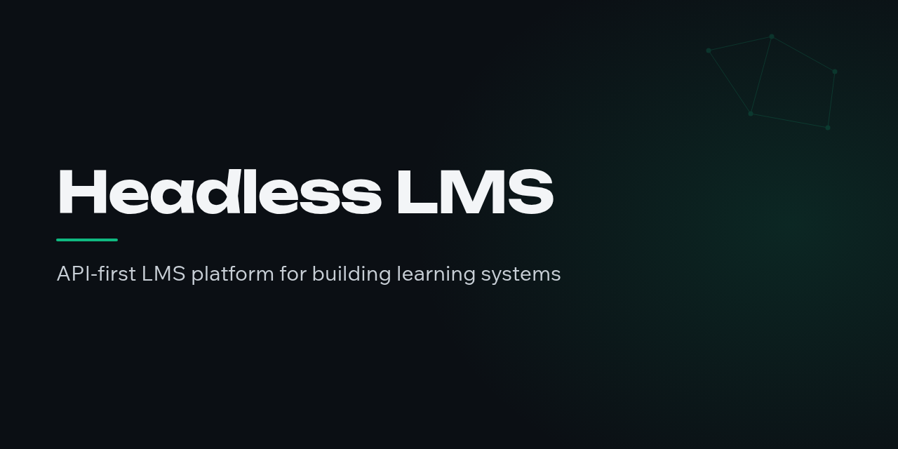

# Headless LMS

<div align="center">



<br/>

[](https://headless-lms.dev)
[](https://www.typescriptlang.org)
[](https://nodejs.org)
[](https://pnpm.io)
[](LICENSE)

**An API-first LMS platform for building learning systems.**

[Features](#features) · [Self-host](#self-host) · [Under the hood](#under-the-hood) · [Documentation](#documentation)

</div>

- Modern TypeScript: Fastify, Drizzle, tsdown
- Composable: use your own tech stack and easily replace any part of the system with your own implementation.
- Ready to fo: Authentication, multi-tenancy, emails, workflows, file hosting, and more are all baked in.
- Headless: build whatever frontend you want on the typed SDK

## What's in the box

It ships with sane defaults so it's ready to go out of the box. Start building courses in less than 5 minutes!

Headless LMS ships with a backend api, an admin portal and course builder and a student portal.

### Core Adapters

|                                | Default adapters                | Package                               | 
|--------------------------------|---------------------------------|---------------------------------------|
| **HTTP Server**                | Fastify                         | @headless-lms/server                  |         
| **Database**                   | Postgresql with Drizzle         |                                       |
| **Authentication**             | better-auth                     |                                       |
| **Email**                      | Resend                          | @headless-lms/adapter-email-resend    |
| **Email Templates**            | React Email                     | @headless-lms/adapter-email-templates |
| **Content Builder & Renderer** | Plate.js builder and components |                                       |
| **File & Media Storage**       | Minio (S3 compatible)           |                                       |
| **Logging**                    | Pino                            |                                       |

### Plugins

|           | Description         | Package                    | 
|-----------|---------------------|----------------------------|
| **Slack** | Slack notifications | @headless-lms/plugin-slack | 

### Frontends

|                    | Description                                                                 | Package      | 
|--------------------|-----------------------------------------------------------------------------|--------------|
| **Admin Portal**   | NextJS,RCS,Tailwind/ShadCN                                                  | apps/admin   |
| **Student Portal** | NextJS built with RCS, Tailwind/ShadCN. Fully featured learning experience. | apps/student |

## Features

| Feature                 | Description                                                                                                                          |
|-------------------------|--------------------------------------------------------------------------------------------------------------------------------------|
| **Course Builder**      | author structured course content; students work through it activity by activity. Replace the course content UI engine with your own. |
| **Progress tracking**   | per-student, per-activity completion, rolled up into course progress and reporting.                                                  |
| **Entitlements**        | grant and revoke student access to content.                                                                                          |
| **Multi-tenant**        | one deployment serves many orgs; every student, course, and session is org-scoped.                                                   |
| **Admin back-office**   | a Next.js dashboard for courses, students, entitlements, and reporting, built on the public API.                                     |
| **Student portal**      | a Next.js app where students log in and take their courses, built on the SDK.                                                        |
| **Media & file assets** | object storage with presigned upload/download URLs.                                                                                  |
| **Integrations**        | drop a plugin folder into your installation and it's live at startup. Write your own against the public contract.                    |
| **MCP endpoint**        | AI agents connect over OAuth and operate the LMS through the same domain layer as every other client.                                |
| **Typed SDK & OpenAPI** | routes validate requests and responses against shared Zod schemas; the SDK is generated from the resulting spec.                     |
| **Transactional email** | invitation and auth mails, swappable behind an adapter.                                                                              |

## Self-host

```bash
npm create headless-lms
```

Create a standalone installation using the cli. It creates a small project that
depends on `@headless-lms/server`, owns its config and plugins, and deploys
anywhere Node and Postgres run.

## Under the hood

The backend ships as a library, `@headless-lms/server`: a framework-free
domain core behind a Fastify HTTP layer, persisted with Drizzle/Postgres.

An *installation* composes what it wants with sane defaults. See `apps/api` for an example project.

## Documentation

- [Architecture](docs/architecture.md)  layers, contexts, and how an
  installation composes the server
- [Project structure](docs/project-structure.md)  what each workspace is
- [`packages/server`](packages/server/README.md)  the backend library
- [`packages/create-headless-lms`](packages/create-headless-lms/README.md)
  the installation scaffolder
- `/docs` on a running API interactive OpenAPI reference

## Developing this repo

Requires Node ≥22, pnpm 10, and Docker.

```bash
pnpm install
docker compose -f docker/docker-compose.yml up -d   # Postgres (:8005) + MinIO (:8006/:8007)
cp .env.example .env        # set BETTER_AUTH_SECRET (openssl rand -base64 32)
pnpm db:generate && pnpm db:migrate
pnpm dev                    # api :8000 · admin :8001 · student :8002
```

`pnpm build` / `test` / `lint` / `typecheck` run across all workspaces;
`pnpm gen:sdk` regenerates the OpenAPI spec + SDK (database must be up).

## Contributing

See [CONTRIBUTING.md](CONTRIBUTING.md)  setup, the checks a PR must pass,
and where things go in the codebase.

## License

[MIT](LICENSE)
